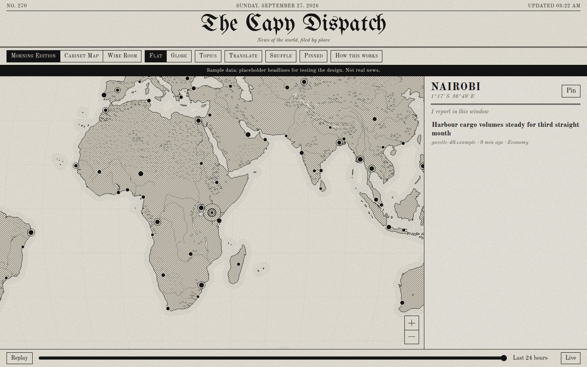
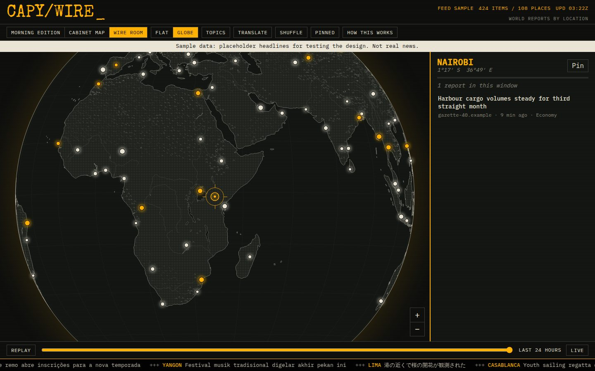

# capy

News, compressed and sourced. Two products in one repository.

- **2DayAI**: one headline per reader per day, from a hand-written interest profile, with the stories, explanations, and sources one click down. Delivered by email. Built and tested; not yet run live. Code in `packages/core`, `db`, `pipeline`, `web`.
- **The map**: a public news map in the spirit of Radio Garden. Turn a flat map or a globe; the place under the crosshair lists what is being reported there, newest first, with an in-app reader. No borders, no country names, no labels on the map. A runnable design prototype with placeholder data; not deployed. Code in `packages/map`.

Start with CONTEXT.md. Decision 23 in docs/DECISIONS.md is the plan: one pipeline and one database for both products, publisher pins, and a telegram line per region, with map work after 2DayAI's milestone 4. The map in `packages/map` is a design prototype built ahead of that on stand-in GDELT data; decision 24 lists what it changes before it ships.

## 2DayAI

See docs/SPEC.md for the design, docs/DECISIONS.md for what changed after the spec, docs/RUNBOOK.md to operate it.

### How it does not lie

Every explanation sentence carries a citation: an article id and a passage. Code checks that the passage appears verbatim in that article. A sentence that fails is removed before anything downstream sees it. An event with fewer than three surviving sentences is unusable and cannot be selected for anyone. The headline is generated from the selected events' verified sentences, never from raw articles. The one paragraph written from a reader's profile rather than the sources is labeled as such on the page.

## The map

| Morning Edition | Cabinet Map | Wire Room |
|---|---|---|
|  |  |  |

Three designs, each in flat or globe view, over a physical-only basemap (Natural Earth coastlines, rivers, lakes, relief, ice). Screenshots use placeholder sample data. The neutrality rules and the map's layout are in packages/map/AGENTS.md.

Its stand-in pipeline, `packages/map/pipeline`, reads the free GDELT index, places each article at the first city it mentions, balances outlets, groups the same story across places, and writes one static JSON file. It is retired when the map moves onto the shared pipeline (decision 24).

## Run it

Requires Node 22. Copy `.env.example` to `.env` for 2DayAI.

```
npm install
npm run check                          # boundaries, typecheck, tests for every package. No network, no key.

# 2DayAI
npm run stage -- sources check         # fetch every feed in config/sources.yaml and report
npm run db:migrate                     # apply migrations to DATABASE_URL
npm run stage -- day --date 2026-09-04 # ingest, enrich, readers sync, cluster, explain, select
npm run stage -- show --reader r01     # print that reader's edition for the date
npm run stage -- deliver --dry-run     # what would be sent right now
npm run stage -- spend                 # model spend for the date

# The map
npm run map:dev                        # http://localhost:5173 with placeholder data and a banner
npm run map:build
npm run map:ingest                     # live GDELT data (needs data.gdeltproject.org)
```

`LLM_BATCH=false` in `.env` makes a local 2DayAI run immediate instead of waiting on the Batches API.

## Layout

- `packages/core`: pure code. Types, Zod schemas, validators, renderers, versioned prompts. Imports nothing else in the workspace.
- `packages/db`: Drizzle schema, migrations, shared read models. Imports core. `@2dayai/db/node` holds the postgres-js client.
- `packages/pipeline`: stages, the CLI, the model module in `src/llm/` (the only place the SDK is imported). Imports core and db.
- `packages/web`: Cloudflare Worker for reader pages and feedback. Imports core and db.
- `packages/map`: the map's design prototype, its stand-in GDELT pipeline and basemap build. Imports nothing else in the workspace yet.
- `config/sources.yaml`: the 2DayAI feed list. `config/readers/`: reader profiles, gitignored except the example.

`npm run lint` fails on any import that crosses those lines.

## Hosting

The repository is private. On a free plan, GitHub Pages does not serve private repositories and Actions has 2,000 minutes a month, so the map's deploy workflow (`.github/workflows/map-deploy.yml`) runs only when started by hand. Making the repository public, or hosting the map elsewhere, is open.
