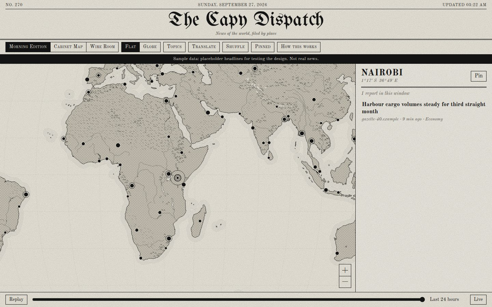
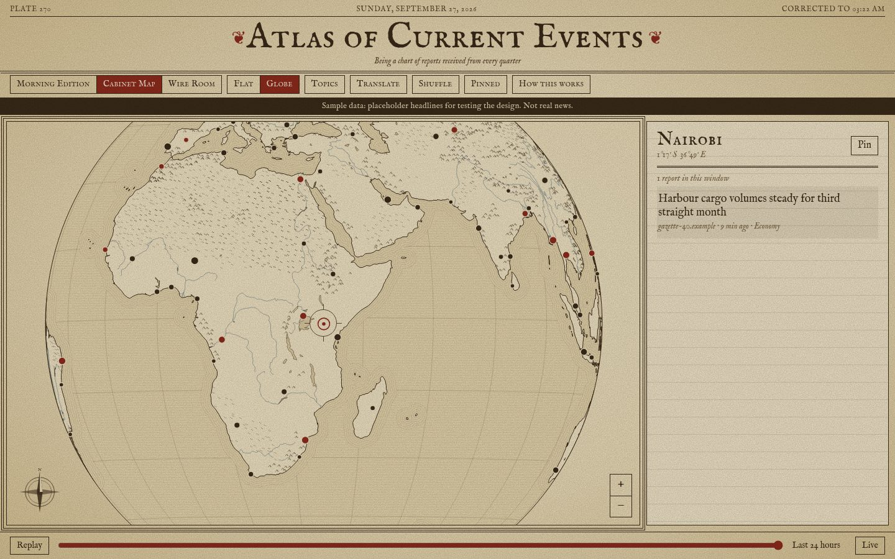
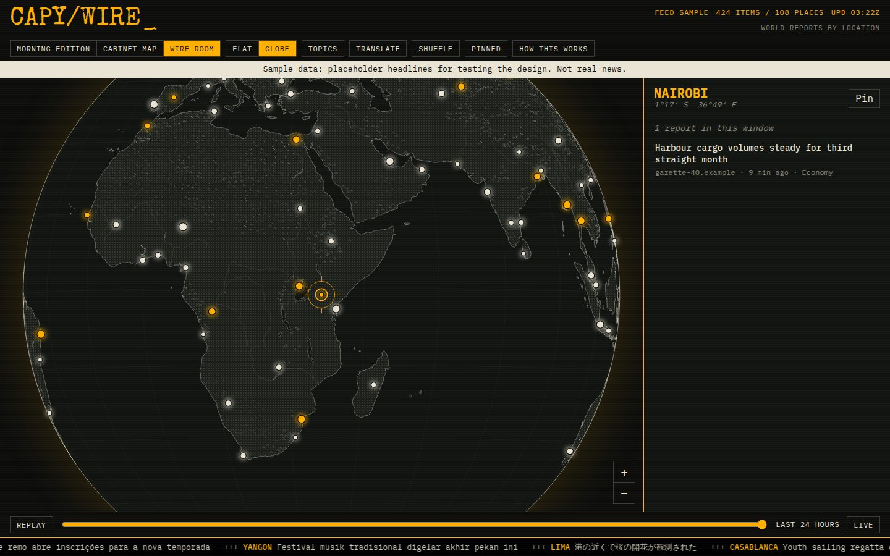

# Capy

World news by place. Turn a flat map or a globe, and whatever sits under the crosshair is what you're tuned to: a list of what outlets there are reporting, newest first. Tap a headline to read the outlet's preview in the app, open the full page inside the app when the outlet allows it, or read it on the outlet's site.

It works like Radio Garden, but for news. It costs nothing to run: free data, a static site, and one scheduled GitHub Action.

| Morning Edition | Cabinet Map | Wire Room |
|---|---|---|
|  |  |  |

Screenshots use placeholder sample data.

## Features

- Three designs, each in flat or globe view: newsprint, an engraved cabinet map, and a dark wire room with a ticker.
- A physical map only: coastlines, rivers, lakes, mountains, deserts and ice. No borders, no country names, no labels on the map.
- An in-app reader with the outlet's headline, image and preview. It shows the full page inside the app when the outlet permits framing.
- "Also reported in N other places": the same story in other cities and languages, drawn as arcs on the map.
- A 24-hour replay slider, topic filters, shuffle, pinned places, and keyboard controls (arrows, +/-, S, Esc).
- Headline translation through the browser's built-in, on-device translator. Nothing is sent anywhere.

## How it's built

```
GDELT GKG (every 15 min, 65+ languages) + optional RSS
  -> one place per article (first city mentioned; country-only articles dropped)
  -> balanced selection (outlets take turns; per-outlet caps)
  -> story grouping across places
  -> outlet preview metadata (robots.txt respected, no article text stored)
  -> public/data/latest.json -> static site on GitHub Pages
```

- Data: [GDELT Project](https://www.gdeltproject.org/) (free, no key) and hand-picked feeds in `pipeline/sources.json`.
- Map: [Natural Earth](https://www.naturalearthdata.com/) physical layers, public domain, prebuilt into `public/basemap/`.
- App: TypeScript, Vite, d3-geo on canvas. No framework, no backend.

## Run it

```
npm install
npm run dev          # uses public/data/sample.json (placeholder data, with a banner)
npm test
npm run ingest       # live data into public/data/latest.json (needs access to data.gdeltproject.org)
```

## Deploy

1. Make the repository public. GitHub Pages and Actions minutes are free for public repositories. A private repo needs a paid plan for Pages, and an hourly job would use more than the free Actions minutes.
2. In Settings, go to Pages and set Source to "GitHub Actions".
3. Push to `main`. `.github/workflows/deploy.yml` runs every hour at :17, pulls the latest GDELT files, rebuilds and deploys. If an ingest fails, nothing is deployed and the previous site stays up.

GitHub pauses scheduled workflows in public repos after 60 days without commits. Re-enable the workflow from the Actions tab if that happens.

## Neutrality

The app is meant to be something anyone can look at without being told what to think. The rules (no borders, no ranking, no rewriting, balanced outlets, no copied articles) are in [AGENTS.md](AGENTS.md#neutrality-rules-hard-rules), and the "How this works" dialog explains them to visitors.

## Credits

News index: GDELT Project. Map data: Natural Earth. Headlines, images and previews belong to their publishers.
