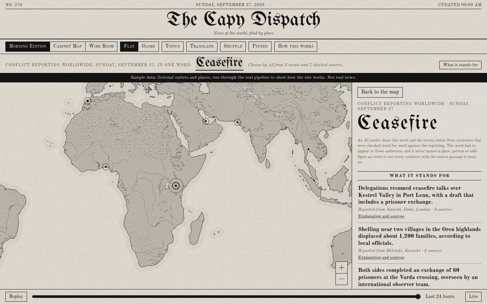
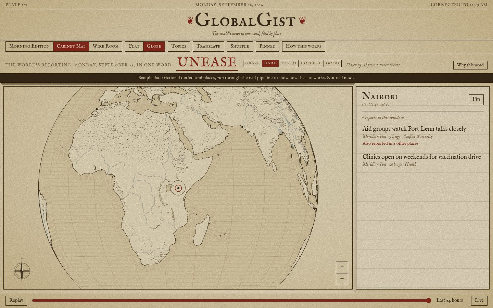
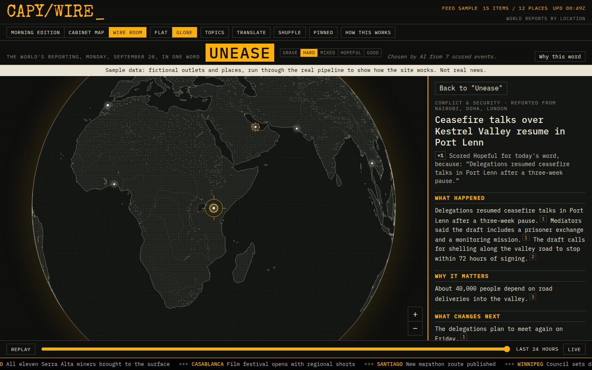
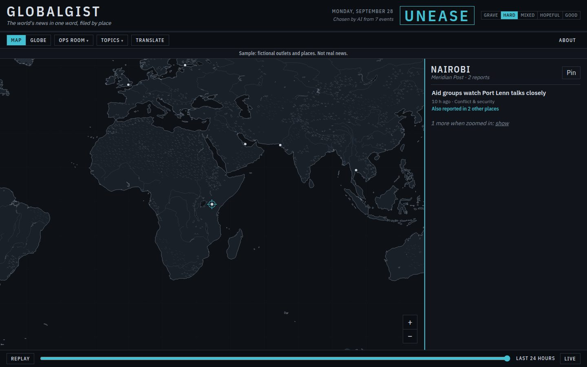
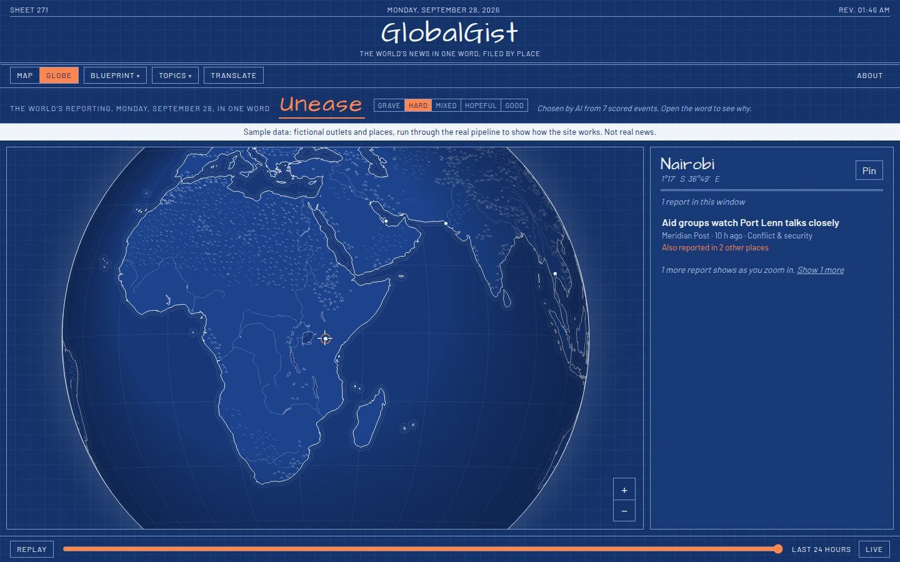

# capy

News, compressed and sourced. Two products in one repository.

- **2DayAI**: one headline per reader per day, from a hand-written interest profile, with the stories, explanations, and sources one click down. Delivered by email. Built and tested, not yet run live. Code in `packages/core`, `db`, `pipeline`, `web`.
- **GlobalGist** (the map): a public news map in the spirit of Radio Garden. One word heads it: the emotion the day's world reporting evokes, on a scale from Grave to Good. Turn a flat map or a globe, and the panel lists what outlets at the place under the crosshair reported, newest first. Open the word to see every event's score and reason, the sourced explanations, and the sources. The map has no borders, country names or labels. Code in `packages/map`, served by the Worker in `packages/web`.

Start with CONTEXT.md. Both products read one database written by one pipeline (decisions 23 and 25 in docs/DECISIONS.md).

## 2DayAI

See docs/SPEC.md for the design, docs/DECISIONS.md for what changed after the spec, docs/RUNBOOK.md to operate it.

### How it does not lie

Every explanation sentence carries a citation: an article id and a passage. Code checks that the passage appears verbatim in that article. A sentence that fails is removed before anything downstream sees it. An event with fewer than three surviving sentences is unusable and cannot be selected for anyone. The headline is generated from the selected events' verified sentences, never from raw articles. The one paragraph written from a reader's profile rather than the sources is labeled as such on the page.

## GlobalGist, the map

| Morning Edition | Cabinet Map | Wire Room |
|---|---|---|
|  |  |  |

| Ops Room | Blueprint |
|---|---|
|  |  |

Screenshots use the fictional sample: invented outlets and places, run through the real pipeline.

- **Stories sit where they happened** (decision 44): the grouping model names the city, and code checks it against a fixed list of world cities before placing it. A story that names no city stays at its outlet's city (the `desk: world` entries in `config/sources.yaml`). The map shows no borders and names no countries.
- **The word.** Each day the `telegram` stage scores every explained world event from -2 to 2 by what happened to people. Each score quotes the sentence it rests on. Code places the day on a five-step scale. The worst significant event sets a bad day, so good news never averages a tragedy away. The model then picks the word from that step's fixed list. The site shows every score and its reason.
- **Four depths.** The word, then the events with one line each, then each event's explanation with numbered citations, then the sources with the passages quoted. Headlines appear as the outlets published them.
- **Hundreds of outlets.** 560 outlets in 501 cities, covering nearly every country and territory, stateless nations and Indigenous communities, and the regions of the ten most populous countries (decisions 31, 45, 48 and 49). Zoomed out, the map shows the most important and most widely reported stories; each step in adds the next of five tiers, and dot size follows importance (decisions 30 and 46). On open it turns until a place lands under the reticle.
- Sixty-four designs, Map or Globe, a 24-hour replay, topic filters, pinned places, and translation into about a hundred languages.

## Run it

Requires Node 22. Copy `.env.example` to `.env` for 2DayAI.

```
npm install
npm run check                          # boundaries, typecheck, tests for every package. No network, no key.

# 2DayAI
npm run stage -- sources check         # fetch every feed in config/sources.yaml and report
npm run db:migrate                     # apply migrations to DATABASE_URL
npm run stage -- day --date 2026-09-04 # ingest, enrich, readers sync, cluster, explain, select
npm run stage -- show --reader r01     # print that reader's edition for the date
npm run stage -- deliver --dry-run     # what would be sent right now
npm run stage -- spend                 # model spend for the date
npm run stage -- eval                  # compare model setups on one day's world articles

# The map
npm run map:sample                     # fictional world day through the real stages, in memory, into the sample data
npm run map:dev                        # http://localhost:5173 on the sample, with a banner
npm run stage -- map export            # the latest real day from DATABASE_URL, as the site sees it
npm run web:deploy                     # build the map and deploy it with the Worker (Cloudflare)
```

The model provider is config (decisions 28 and 29). OpenAI's gpt-5.4-nano, with gpt-5.4-mini for the word, is the default. `npm run stage -- eval` compares models on one real day: cost, the code checks, and every score with its reason. See docs/RUNBOOK.md, "Choose a model".

## Layout

- `packages/core`: pure code. Types, Zod schemas, validators, renderers, versioned prompts. Imports nothing else in the workspace.
- `packages/db`: Drizzle schema, migrations, shared read models. Imports core. `@2dayai/db/node` holds the postgres-js client.
- `packages/pipeline`: stages, the CLI, the model module in `src/llm/` (the only place the SDK is imported). Imports core and db.
- `packages/web`: Cloudflare Worker: the map site and its data, reader pages, feedback. Imports core and db.
- `packages/map`: the map site. Imports core's types only and reads its data from the Worker.
- `config/sources.yaml`: every feed, on the briefing desk (2DayAI) or the world desk (the map, with a place per outlet). `config/readers/`: reader profiles, gitignored except the example.

`npm run lint` fails on any import that crosses those lines.

## Hosting

The Worker serves the map, its data and the reader pages on Cloudflare's free plan, so it needs nothing from GitHub but Actions. `.github/workflows/deploy-site.yml` deploys on code changes once `CLOUDFLARE_API_TOKEN` and `CLOUDFLARE_ACCOUNT_ID` are set. The daily run needs no deploy: it stores the day's file and its tiles of local stories in R2, and the Worker serves them (decisions 73 and 78). The repository is public, so Actions minutes are free (decision 130); on a private repository the daily run (about 30 minutes), the refresh every three hours (about five minutes now that it groups the outlets' new stories) and CI came to well over the 2,000 free minutes a month. The site check (`site-check.yml`, decision 85) adds one run of about a minute a day, 30 minutes a month.

The free Workers plan allows 100,000 requests a day. The day's file is one request per visit; someone who zooms in all the way asks for the tiles in view, typically 5 to 25 more. At about 20 tile requests per visitor who zooms in, that is room for some 4,000 such visitors a day before the paid plan (5 USD a month, 10 million requests) is needed.
